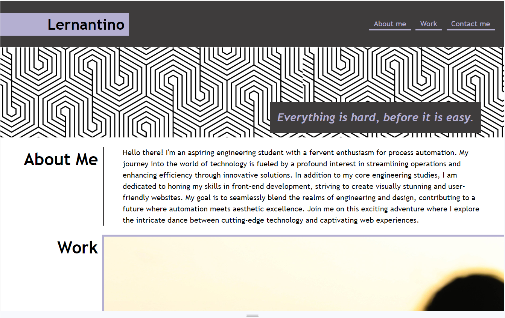
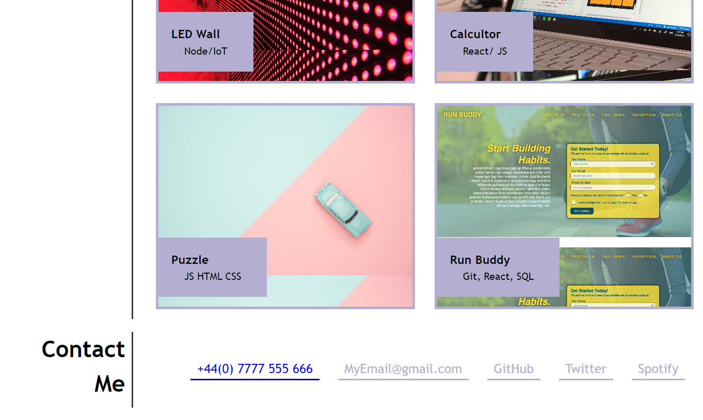

# Unit 2 Challenge: Portfolio

## Description

Portfolio website demonstrating presentable project, description and contact details.

## Setup

For local copy use ```git clone```

For online view use GitHub pages

## Website features

+ Responsive design based on windows width
+ Project images are highlighted when hovered
+ Navigations links scroll to the relevant section



